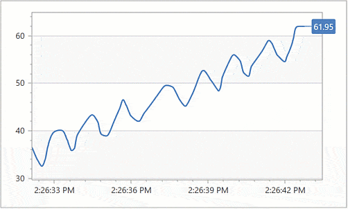

<!-- default badges list -->

<!-- default badges end -->

# Chart for WPF - Create a Real-Time Chart

This example shows how to create a chart and update its data source in real time.

The example uses an [ObservableCollection](https://docs.microsoft.com/en-us/dotnet/api/system.collections.objectmodel.observablecollection-1?view=net-6.0) as the data source for a series. `ObservableCollection` notifies the chart about new items and the chart is rendered again.

## Files to look at

* [MainWindow.xaml](./CS/RealtimeChartMVVM/MainWindow.xaml) (VB: [MainWindow.xaml](./VB/RealtimeChartMVVM/MainWindow.xaml))
* [MainWindow.xaml.cs](./CS/RealtimeChartMVVM/MainWindow.xaml.cs) (VB: [MainWindow.xaml.vb](./VB/RealtimeChartMVVM/MainWindow.xaml.vb))

## Documentation

* [How to: Create a Real-Time Chart (MVVM)](https://docs.devexpress.com/WPF/401796/controls-and-libraries/charts-suite/chart-control/examples/providing-data/how-to-create-a-real-time-chart?p=netframework)
* [Best Practices: Display Large Data](https://docs.devexpress.com/WPF/400482/controls-and-libraries/charts-suite/chart-control/provide-data/best-practices-display-large-data)
* [Series](https://docs.devexpress.com/WPF/6339/controls-and-libraries/charts-suite/chart-control/series/series)

## More Examples

* [How to bind a chart to its ViewModel](https://github.com/DevExpress-Examples/how-to-bind-a-chart-to-its-viewmodel-t541777)
* [How to generate Series of identical view types using the MVVM binding style](https://github.com/DevExpress-Examples/how-to-generate-series-of-identical-view-types-using-the-mvvm-binding-style-t513360)
* [How to bind a chart to an observable collection](https://github.com/DevExpress-Examples/how-to-bind-a-chart-to-an-observable-collection-e2595)
<!-- feedback -->
## Does this example address your development requirements/objectives?

 

(you will be redirected to DevExpress.com to submit your response)
<!-- feedback end -->
